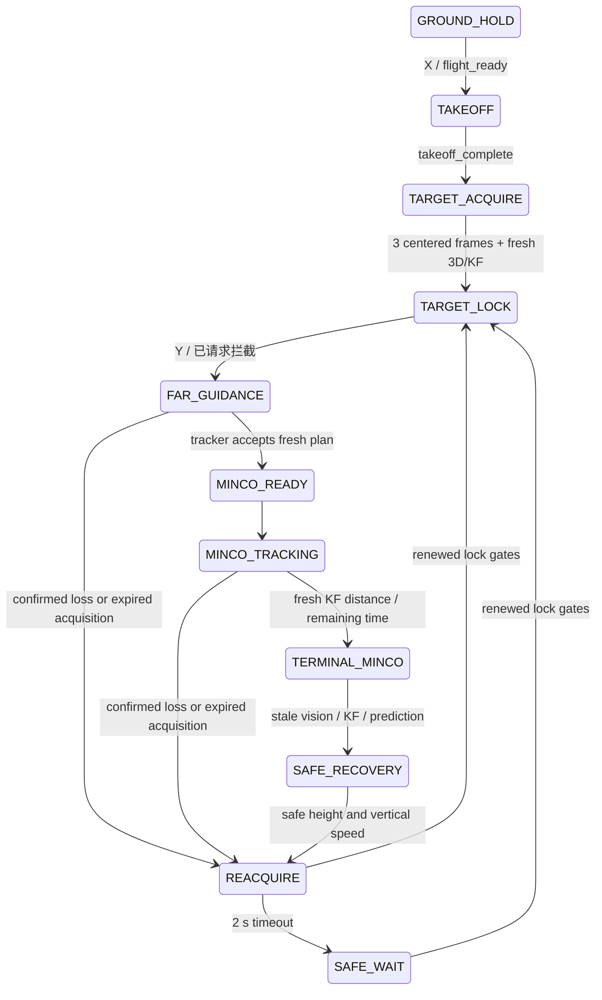

# 严格视觉闭环：P8.2 / P8.3 实现与用户仿真交接

2026-09-30，工作区 `/home/qin/data/uav_usv`，在当前 `master` 上修改，未提交、未推送。依据 [原始需求](../superpowers/specs/2026-09-30-strict-visual-loop-requirements.md)。用户明确要求自行仿真，本次没有启动 Gazebo、PX4 SITL 或执行飞行实验。

代码阶段完成：在线目标输入使用视觉/KF/BCTRA；新增 RGB bearing、搜索/锁定/重捕获及单一 yaw 仲裁；移除评价结果对任务和仿真环境的反馈。构建及软件测试通过。运行时闭环、漂移、海面安全及时间有效率仍需 Phase A–E 验证，不能以单元测试替代。

## 1. Truth audit 结果

先完成审计，再依据用户“继续修改”执行。审计覆盖 `src/`、`scripts/` 及 bringup 内配置/launch；根目录没有独立的 `config/`、`launch/`。原始精确关键词结果 102 行、扩展结果 586 行；AST 提取 92 处 subscription 调用。关键词命中包含配置、测试、纯函数及历史实现，不等于活动消费者数量。

原始证据在 [p8_2_audit_20260930](p8_2_audit_20260930/)：`literal_truth_matches.txt`、`expanded_truth_matches.txt`、`subscription_inventory.json`。修改后重新生成 `post_truth_matches.txt` 和 `post_subscription_inventory.json`（91 处源码 subscription 调用，包含被禁用的历史构造器及离线脚本）。以下分类按实际数据路径判断。

| 消费者/路径 | 分类 | 原先语义 | 当前处理 |
|---|---|---|---|
| intercept_evaluator_node、GazeboEntityPoseTracker、评价纯函数 | A evaluator/logger | 目标 truth、实际 entity 与同刻误差、预测误差、成功判定 | 保留，`truth_role=evaluation_only`；不暂停世界、不控制任务 |
| vision_static_capture、继承它的 P5/P6 capture、P7 capture/分析及历史 CSV 分析 | A/B offline diagnostics | 采集 truth、UAV groundtruth 或离线归因 | 保留，非 modular 在线命令路径 |
| front_tof_monitor → dual_tof_selector | B，但原来直接读取目标 truth | `/target/position` 生成视角/FOV，非实际图像 bearing | 删除 monitor 的 truth subscription；旧 angle/FOV 输出在无目标几何时无效，不用于控制；selector 保持可关闭的诊断节点 |
| rgbd_target_localizer、target_bearing_node、target_kalman_filter | C perception/tracking | 图像、深度、UAV pose、时钟 | 不读取 USV truth；Gazebo Clock 仅提供时间关系 |
| target_predictor_node | D predictor | tracking 模式，但保留 simulation_truth 分支和参数 | 删除 truth 分支，tracking-only；拒绝 truth 配置/重映射 |
| intercept_planner_node | D planner | BCTRA 预测、UAV 当前状态、MINCO 求解 | 保留估计链；搜索/恢复取消旧异步周期及 contact 状态 |
| trajectory_tracker_node | E/G controller/safety | 直接 `/target/state`，用于 FAR、yaw、距离、任务终端切换；endpoint 原已使用 BCTRA | 当前位置/速度使用新鲜 KF，未来 endpoint 使用新鲜 BCTRA；yaw 使用实际 RGB bearing；安全使用 UAV 状态/海面几何 |
| mission_manager_node | F mission | evaluator result 决定 CAPTURE/FAILURE，影响命令 | 删除 result subscription；仅消费用户命令及 tracker 诊断 |
| moving_target | 环境生成器及原间接反馈 | 生成 truth；接收 evaluator hit/result 冻结目标或暂停世界 | 保留环境运动与 truth 发布，删除 hit/result 反馈 |
| pure_pursuit、predictive_intercept、trajectory_impact_sim 及两个 archive 控制器 | E/F/G legacy | truth 控制与评价混合 | 移除 console entrypoint；构造器在 ROS 注册前直接报错。源码留作历史/离线数学参考 |
| baseline_intercept.launch.py | 在线入口 | 旧 truth 控制图 | 转为 modular launch 的兼容入口 |

`moving_target` 是仿真环境的 truth **发布者**，其运动参数留在环境端。在线控制没有订阅这些参数/未来轨迹。旧源码仍含 truth 字符串，不能把全仓库零命中作为验收；需同时确认入口禁用和活动 ROS graph。

## 2. 删除或替换的 truth dependency

tracker 不仅更换 topic 名，替换了各使用点：

| tracker 使用点 | 当前数据与 gate |
|---|---|
| 起飞水平追赶 | TAKEOFF 不传目标，保留升高逻辑 |
| FAR_GUIDANCE/FOLLOW | `/tracking/target_state` 的有效 local NED 位置/速度；状态戳和图像 `source_stamp` 都需新鲜 |
| endpoint mismatch、plan replacement | 当前有效 BCTRA 在轨迹 contact 时刻插值，与消息自身 terminal endpoint 比较；保持原连续性/安全检查 |
| terminal handover、target distance | 新鲜 KF 距离；无估计时为 inf，避免默认零触发终端 |
| yaw、丢失方向 | `/perception/front/target_bearing`，图像采集戳与图像左右位置 |
| 新轨迹许可 | fresh KF、锁定、tracking provenance、新鲜预测及轨迹的原始 observation stamp |

主预测器只允许 tracking；tracker 参数和重映射也限制为 `/tracking/target_state`。Invalid/frame 不一致/零戳/未来戳/过期来源会撤销缓存；有效乱序旧 KF 不撤销较新缓存。没有 truth fallback。

TargetPrediction 与 InterceptTrajectory 新增不可刷新的 `observation_stamp`。KF `stamp` 是状态估计/投影时刻，KF `source_stamp` 是实际图像采集时刻；prediction `source_stamp` 仍是预测样本 epoch；trajectory `source_stamp` 仍是执行开始时刻。求解完成、发布、接收都不能把旧图像变新。

Evaluator 可以记录 `/simulation/impact/result`、hit 和成功统计，但这些输出不再连接 mission/moving_target，也不暂停 Gazebo。**评价成功或失败不再自动终止在线任务或冻结环境**。自动运行结束需后续设计基于在线可观测信息的判定；当前由操作者管理实验结束。

## 3. 状态机

保留旧枚举数值，追加 TARGET_ACQUIRE=13、TARGET_LOCK=14、REACQUIRE=15、SAFE_RECOVERY=16。既有 MINCO_READY 对应需求中的 MINCO_ENTRY，未重编号。



只按 X 起飞后停留在 ACQUIRE/LOCK，不自动拦截；Y 仅在稳定锁定时接受。已经请求过拦截的任务在重锁定后回 FAR 并重新规划。搜索是 mission/tracker 行为，未塞入 MINCO。

## 4. Yaw ownership

只有 tracker 发布 PX4 TrajectorySetpoint，所有命令分支最后经过 `_final_yaw`。bearing、visibility、localizer、planner 不发布 PX4 yaw。

| 阶段 | yaw_owner | XYZ |
|---|---|---|
| 低于搜索高度、GROUND、SAFE_RECOVERY | HOLD，yaw rate=0 | 地面保持/安全起飞/海面安全恢复 |
| ACQUIRE/REACQUIRE/搜索 SAFE_WAIT | SEARCH | 捕获固定 XYZ anchor；RGB 可见时用 bearing 限速对准，不要求有效深度 |
| TARGET_LOCK/FAR/MINCO | VISION | KF guidance 或轨迹跟踪 |

视觉 servo：`clamp(vision_yaw_gain * bearing, ±rate_limit)`，`abs(bearing)<0.03` 时为零。未锁定上限 0.6 rad/s，锁定后保持原 `max_observation_yaw_rate=1.0`。绝对 yaw 从当前 PX4 heading 与本次限幅 dt 构造，同时写 yaw-rate，均由同一 arbiter 负责。

图像光学轴为 x 向右、z 向前；到 body FLU 时图像右对应 body 右，再到 NED 正 yaw 为顺时针，因此 **bearing>0 → 正 yaw**。图像左右及相机 FLU/NED 转换测试验证该符号。

## 5. 搜索算法及 lock/loss gate

新增轻量 RGB-only detector 接口 `/perception/front/target_bearing`，包含 mapped acquisition `stamp`、`raw_stamp`、valid、bearing、confidence；复用红色 mask/intrinsics 与现有 Gazebo image-clock mapper，不复制 3D localizer。深度或 pose 不可用时仍可对准，但不能据此获得 3D/KF 锁定。

`bearing=atan((u-cx)/fx)`。曾见到目标：记录最后有效 bearing 符号，搜索相对进入时中心依次为 +0.52、−1.04、+1.56 … rad（左侧则反号），到 ±π 有限全视野扫掠；实际 yaw 穿越端点后推进，避免端点附近来回振荡。扩展阶段最多 12 个，存在有限时间预算，机体 yaw 不动也最终停止。

从未见到目标：固定方向 0.25 rad/s，最多一圈后 SAFE_WAIT，不能借 truth 寻方向。重捕获 2 s 后进入 SAFE_WAIT，保持 XYZ；安全高度上的有限 scan 可以继续到有限扫掠结束，然后 yaw rate=0，不无限扫描。

Lock：至少 3 个不同采集戳、相邻帧间隔 ≤0.15 s、最新 bearing age≤0.15 s、bearing≤0.15 rad，另需有效新鲜 3D observation 和 KF。10 Hz 连续三帧可以锁定，不要求三帧全部挤进当前 0.15 s 窗口。重复、乱序帧不增加计数；重新出现单帧不能重锁。

Loss：连续 3 个不同无效图像帧确认丢失，静默用采集时间 age 而非 timer 次数判断。1–2 帧允许保持已有锁定，**仅在原有 KF/BCTRA acquisition age≤0.125 s 时继续追踪**。0.125 s 硬新鲜度先于帧数迟滞/0.3 s 终端超时，低帧率时可能尚未满 3 帧就因过期保持/恢复；不放宽该安全限制。

搜索入口捕获固定 XYZ，不随实测漂移每周期重设；退出搜索恢复 FAR/MINCO 时清理旧 anchor。该设计保证 reference 固定，真实 XY 漂移仍需仿真测量。

## 6. Terminal loss

终端阶段视觉锁定/KF失效或预测采集来源过期时，立即撤销 pending/active trajectory，停止继续接受下降计划，使用现有连续制动与 sea-safe recovery，而不是近海面悬停旋转。

恢复到 `max(recovery_clearance, target_search_enable_height)`，并满足原起飞垂向速度容差后才释放恢复 latch、允许 REACQUIRE yaw。恢复期间 yaw=0。保留最后有效图像方向，达到安全高度后重新进行锁定与规划。软件测试包含 search=1.5 m、recovery=2.0 m、实际高度=1.7 m 的括号情形，证明不能在低于 recovery 的高度直接 hold。

## 7. 参数与日志

搜索参数全部在 `src/uav_usv_bringup/config/baseline.yaml` 的 tracker 块，使用需求给出的初值：

```yaml
target_search_enable_height: 1.5
initial_search_yaw_rate: 0.25
reacquire_yaw_rate: 0.35
maximum_search_yaw_rate: 0.6
target_lock_min_frames: 3
target_loss_frames: 3
target_lock_max_age: 0.15
target_lock_max_bearing: 0.15
target_center_deadband_rad: 0.03
vision_yaw_gain: 1.0
target_reacquire_timeout: 2.0
search_initial_arc: 0.52
search_arc_increment: 0.52
terminal_loss_recovery_timeout: 0.3
```

ControllerDiagnostic 和实验主 CSV 记录 visible/locked、search_state/direction、原始 observation age、bearing、yaw rate、连续帧计数、KF acquisition age、prediction acquisition/sample age、plan acquisition age、yaw_owner。trajectory_age 仍是执行开始以来的年龄，不能当成 measurement age。

打开原有 `geometry_diagnostics_enabled` 后，vision CSV 记录图像时刻四元数、UAV pose、range，并新增由这些已有字段计算的 `image_bearing`、`px4_heading`；无几何时为 NaN，离线 JSON 输出 null，不伪造零。没有修改 P8.1 production localizer。

参数 invariants 已对照 HEAD 自动验证：KF、RGB-D localizer、planner 整块 YAML 完全一致；未改 Q/R、MINCO 权重、pose 等待窗口、0.125 s stale limit、现有 0.50 m evaluation capture radius 及海面安全参数。证据见 `parameter_invariants.json`。

## 8. 软件测试及结果

全包从 `src/uav_control` 运行：**626 passed，1 skipped**；包含 flake8、pep257，2 个第三方 entry-point API 弃用 warning。三包 `uav_usv_interfaces/uav_control/uav_usv_bringup` symlink 构建成功。`bash -n`、`git diff --check`、launch `--show-args` 通过；后者只展开参数，没有启动节点或仿真。

| 需求测试 | 软件证据（test/ 下） | 运行时状态 |
|---|---|---|
| 1 起飞→锁定→FAR | strict_visual_control、mission_manager、modular_pipeline_integration | 待 Phase B |
| 2/3 左右消失→正确方向→重锁 | target_bearing 符号变换；target_visibility 方向/重出现测试 | 待 Phase A/C |
| 4 初始不可见，无 truth | target_visibility 一圈停止、低高度禁止扫描；launch/入口审计 | 待 Phase A/B |
| 5 单帧、6 连续丢帧 | target_visibility loss 迟滞/不同采集帧计数/静默 | 待 Phase C |
| 7 单帧不 lock、8 三帧 lock | target_visibility 单帧重捕获/各 gate/10 Hz 三帧 | 待 Phase B/C |
| 9 XYZ hold | strict_visual_control 固定 anchor 不随测量漂移 | 真实漂移待测 |
| 10 视觉 yaw | target_bearing 符号，strict_visual_control servo/权限/限速 | 待 Phase B |
| 11 MINCO bounded stale | predictor/planner acquisition provenance、strict KF/计划 gate | 待 Phase D |
| 12 terminal recovery | visibility 超时/latch；strict 更大 recovery 高度、invalid KF 抢占 | SEA_CONTACT 待测 |
| 13 truth publisher 存在但不在线订阅 | AST inventory、tracking topic/remap 限制、历史控制器启动拒绝 | ROS graph 待检查 |
| 14 evaluator 关闭 | launch 必需节点无条件，evaluator 独立 condition；无 result 反馈 | 待关闭后运行 |
| 15 timesync reset | bearing reset、搜索 clock rewind；75 项现有 localizer 测试更新 fixture 后通过 | 新仿真待测 |
| 16 单一 yaw/发布者 | strict 单一 arbiter、launch 仅一命令 owner | ROS graph 待检查 |

新增 P8.5 analyzer 15 项测试；不执行在线拟合或补偿。审查发现的缓存锁定滞后、较大 recovery 高度和有效乱序 KF 问题已有回归测试。最后补充左右 yaw 穿越扫描端点用例。

复查命令：

```bash
cd /home/qin/data/uav_usv/src/uav_control
source /opt/ros/humble/setup.bash
source /home/qin/data/uav_usv/install/setup.bash
ROS_LOG_DIR=/tmp/uav_usv_ros_logs python3 -m pytest -q --tb=short
```

## 9. 完整闭环实验结果与自行仿真步骤

**本次未运行新的闭环实验。** 历史最新 `20260929_213155_029414_mission_1_vision.csv` 重算：49 行、47 有效（95.918%）、AFTER_HISTORY=0、水平 RMSE=0.566166 m、Y mean=−0.519791 m；有效跨度仅 5.068 s。紧邻前两次日志则分别有 292/292 和 219/219 AFTER_HISTORY。不能把短日志视为改后时间验收、鲁棒性或命中率。

以下命令留给用户执行，本次没有执行。正常干净会话启动：

```bash
cd /home/qin/data/uav_usv
./scripts/uav_lab.sh --no-build
```

X 起飞，等待 `/mission/state` 为 TARGET_LOCK 再 Y。Phase B 只 X，不 Y；搜索/锁定仍自主进行。脚本 Q 只退出命令台，**不是停机命令**；R 沿原流程重启干净仿真。

另一个终端查看与记录：

```bash
source /opt/ros/humble/setup.bash
source /home/qin/data/uav_usv/install/setup.bash
ros2 topic echo /control/diagnostic
# 或单独查看任务状态
ros2 topic echo /mission/state
# 为后续离线分析记录，不把 truth 加入在线控制：
ros2 bag record /perception/front/target_bearing \
  /perception/front/target_observation /tracking/target_state \
  /planning/target_prediction /planning/intercept_trajectory \
  /control/diagnostic /mission/state
```

按阶段逐步验收，保留失败日志：

| 阶段 | 操作 | 验收点 |
|---|---|---|
| A | 独立静态图像/heading 或安全 hover fixture，将红目标从画面左右移出；低于 1.5 m 不期待实体 yaw | 正负 bearing 与 yaw 一致，last-seen direction，一圈/分阶段有界，XYZ reference 固定 |
| B | 干净会话 X、不 Y | 安全起飞→ACQUIRE→三帧 LOCK；未锁定 Y 被拒绝 |
| C | 通过环境侧移动/遮挡使目标离开 FOV，勿向控制器发送目标坐标 | 迟滞、strict age 抢占、REACQUIRE、单帧不重锁、三帧重锁 |
| D | 新干净会话关闭 evaluator 和 shadow 后 X/Y；保持环境 truth publisher 用于 graph 检查 | 完整视觉链运行，在线节点不订阅 truth，单一 PX4 发布者，无评价反馈 |
| E | 逐个环境工况：直线、figure-eight、急转、S-turn、加减速、bounded random turn-rate | 各工况 valid rate、AFTER_HISTORY、锁定率、重捕获时间、漂移、最低 clearance、SEA_CONTACT、成功统计 |

Phase D 启动脚本支持显式独立开关：

```bash
UAV_USV_ENABLE_EVALUATOR=false UAV_USV_ENABLE_SHADOW_PERCEPTION=false \
  /home/qin/data/uav_usv/scripts/uav_lab.sh --no-build
```

关闭 evaluator 没有 truth-based 成功统计，使用 bag/诊断验证命令链；需要评价时下一次干净会话恢复默认 true。仅关闭 shadow 不再关闭必需 image bridge、bearing、localizer、KF。

运行时审计，逐个 node info 确认在线订阅与唯一发布者：

```bash
ros2 topic info /target/state -v
ros2 node info /trajectory_tracker_node
ros2 node info /target_predictor_node
ros2 node info /intercept_planner_node
ros2 node info /mission_manager_node
ros2 node info /rgbd_target_localizer
ros2 node info /target_kalman_filter
ros2 node info /target_bearing_node
ros2 topic info /fmu/in/trajectory_setpoint -v
```

`/target/state` 订阅者只应有 evaluator 或明确启动的离线采集器，不能出现上述在线节点。也检查 `/target/position`、`/target/velocity`、`/simulation/impact/result`、hit 不通向控制或环境运动。关闭 evaluator 的会话仍有环境 truth publisher，这是验证“不订阅”的条件；不需要删除目标模型或环境状态生成。

P8.5 独立归因会话：复制 baseline 到个人实验 YAML，只将 localizer `geometry_diagnostics_enabled` 改为 true；需要 entity 分层评价时只在 evaluator 打开 `gazebo_entity_diagnostics_enabled`。通过 `UAV_USV_EXPERIMENT_CONFIG_FILE=/absolute/path/to/experiment.yaml` 启动。若新会话有效率下降，先比较采集戳/算力/拒绝原因，不调 Q/R 或时间阈值。

```bash
python3 /home/qin/data/uav_usv/scripts/p8_visual_bias_analysis.py \
  --vision /absolute/path/to/new_mission_vision.csv \
  --output /absolute/path/to/p8_bias.json
# 如已有共同 NED、因果对齐到同一图像采集时刻的 heading 参考：
python3 /home/qin/data/uav_usv/scripts/p8_visual_bias_analysis.py \
  --vision /absolute/path/to/new_mission_vision.csv \
  --heading-reference /absolute/path/to/heading_reference.csv \
  --output /absolute/path/to/p8_bias_with_heading.json
```

参考 CSV 列为 `measurement_stamp,px4_heading,reference_heading`，单位 s/rad；匹配容差最多 1 µs，拒绝重复歧义，不外推、不拟合延迟。参考 UAV yaw 可从单独的 ULog/评价证据准备，不能用 USV truth 方位当作 UAV yaw 参考。输出分析 `range*sin(delta_yaw)`、有符号 NED 几何贡献、相关性与残差；没有参考或几何时明确 not_evaluated，相关性也不能单独证明因果。

## 10. 仍然存在的问题

1. 水平约 0.57 m、Y 约 −0.52 m 系统偏差未修正，历史最新日志缺少几何及同刻 heading reference，本次不能确认 yaw bias 主因。视觉 servo 只维持 FOV，不能修正 PX4 EKF yaw 偏差。
2. 红球检测仍只是感知接口验证，尚非无标记非合作 USV 检测。后续 YOLO bbox 可替换 bearing detector，搜索状态机接口保留。
3. Phase A–E、实际 ROS graph、闭环命中、重捕获成功率、真实 XY 漂移及海面安全均未运行。本次软件测试不足以宣称最终飞行验收。
4. 0.125 s acquisition stale limit 比三帧丢失窗口更严格，实际规划/传输延迟可能导致频繁拒绝或恢复；应采集证据再分析，未自动调参。
5. 当前环境 moving_target 仅内置 linear / figure_eight。Phase E 的急转、S-turn、加减速与随机转率需要环境侧独立 fixture/后续扩展，不能把这些参数或未来轨迹传入在线控制。
6. 评价完成不再控制停止/暂停；没有新增基于视觉的 capture 终止判定。操作者须管理实验结束；禁止重新接入 truth result 达到自动停止。
7. 旧 truth 数学/历史实现文件仍存在，入口已禁用；源码审计与部署 graph 审计需要一起做。没有修改历史视频、历史 CSV 或记忆文件。
